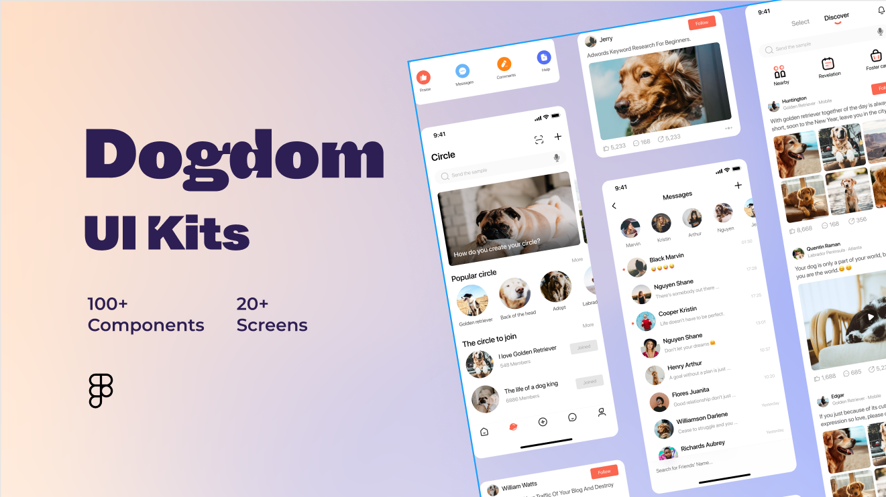

# Dogdom

Dogdom is a dog adoption sample application built to demonstrate Flutter framework.
This is a pet project to test new technologies for me.

## Built With 🛠
- [BLoC](https://pub.dev/packages/flutter_bloc) - State management.
- [Hive](https://pub.dev/packages/hive) - Lightweight and blazing fast key-value database.
- [GetIt](https://pub.dev/packages/get_it) - Service Locator for Dart and Flutter projects.
- [Freezed](https://pub.dev/packages/freezed) - Code generator for unions/pattern-matching/copy.
- [AutoRoute](https://pub.dev/packages/auto_route) - Flutter navigation package uses code generation to simplify routes setup.
- [EasyLocalization](https://pub.dev/packages/easy_localization) - 🚀 Easy translations for many languages.

## Demo

## Code generation

### Runner

flutter packages pub run build_runner build

flutter pub run build_runner build --delete-conflicting-outputs

Rebuild after any changes in file:
flutter pub run build_runner watch --delete-conflicting-outputs

### Localization

Localization asset loader class:
flutter pub run easy_localization:generate -S 'assets/translations/'

Localization locale keys:
flutter pub run easy_localization:generate -S 'assets/translations/' -f keys -o locale_keys.g.dart

### Credits

Design by [znredesign](https://www.behance.net/znredesign)

